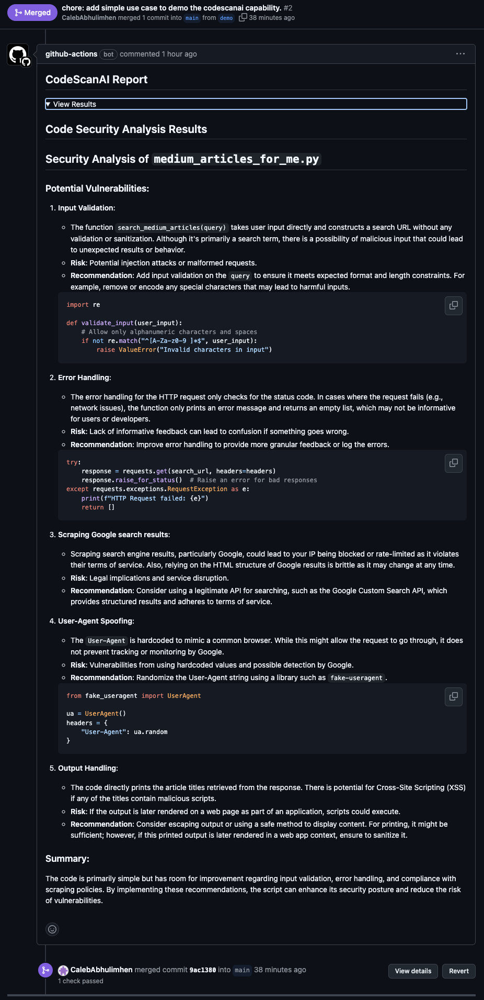

# codescanai-demo

An illustrative E2E demo of the [CodeScanAI](https://github.com/codescan-ai/codescan) project.

This demo provides an overview of developers can utilize CodeScanAI in their software development process. Integrating this into the development workflow will ensure the codebase is in check with industry standard security and coding practices.

There are two ways to integrate CodeScanAI into the development process:

- As a CLI command (through **pypi**).
- As a part of your CI/CD Github workflow.

## Local CLI Usage

CodeScanAI is provided as a python package through PyPi. See the [offical PyPi release](https://pypi.org/project/codescanai/) for further exploration.

You can install this python package, and run the command via the CLI to scan your source code for vulnerabilities before commiting their changes.

### How to use CodeScanAI locally
1. **Run CodeScanAI from the command line**:

   ```bash
   pip install codescanai
   
   export OPENAI_API_KEY=<KEY>
   
   codescanai --provider openai --directory ./main
   ```
2. **Review the output**: 
    CodeScanAI will scan the code in the specified directory (or by default the working directory) and output the results directly on your console.

    The first part of the output shows which files were read and/or skipped. While the rest shows the AI generated report of your source code vulnerabilities/risks and provides suggestions/solutions on how to make the code more secure.


## CI/CD Github workflow.

CodeScanAI can also be integrated into your CI pipeline using GitHub Actions/Workflows. The project provides a Github action to make this easier for developers. See the action:
- in the [Github Marketplace](https://github.com/marketplace/actions/codescanai-action), OR
- on the [codescanai-action repo](https://github.com/codescan-ai/codescanai-action).

Example of how the CodeScanAI output is [commented](https://github.com/codescan-ai/codescanai-demo/pull/2#issuecomment-2323088818) on this PR:



### Actual Implementation.

In the example below, we create a workflow configured to run on pull requests targeting the `main` branch. 
The worflow:
- scans the code changes introduced in the pull request (passing appropriate arguments to the codescanai-action), 
- generates a CodeScanAI report,
- and posts the report as a comment on the pull request.

This is a summarized version of the [Demo CI Workflow](https://github.com/codescan-ai/codescanai-demo/blob/main/.github/workflows/codescanai-ci.yml)

```yaml
name: An example CI workflow to use codescanai-action

on:
  pull_request:
    branches:
      - main
  workflow_dispatch: {}

jobs:
  demo:
    runs-on: ubuntu-latest
    permissions:
      contents: read
      pull-requests: write
      issues: write

    steps:
      - uses: actions/checkout@v4
      # Use the codescanai-action to generate a  CodeScanAI report.
      - name: Run CodeScanAI Action
        id: codescan-ai
        uses: codescan-ai/codescanai-action@v1.0.1
        env:
          OPENAI_API_KEY: ${{ secrets.OPENAI_API_KEY }}
        with:
          provider: "openai"
          changes_only: true
          pr_number: ${{ github.event.pull_request.number }}
          repo: ${{ github.repository }}
          github_token: ${{ secrets.GITHUB_TOKEN }}
          output_file: "codescanai_report.txt"

      - name: Check CodeScanAI report exist
        shell: bash
        run: |
          codescanai_report_file="codescanai_report.txt"

          # Check if the output file exists and is not empty
          if [[ ! -s "$codescanai_report_file" ]]; then
            echo "No output detected from CodeScanAI action."
            exit 1
          fi

          echo "CodeScanAI action produced output successfully."

      - name: Comment CodeScanAI Output to PR
        uses: actions/github-script@v7
        if: ${{ github.event_name == 'pull_request' }}
        with:
          script: |
            const fs = require('fs');
            const output = fs.readFileSync('codescanai_report.txt', 'utf8');

            const {data: comments} = await github.rest.issues.listComments({
                owner: context.repo.owner,
                repo: context.repo.repo,
                issue_number: context.issue.number,
            })
            const botComment = comments.find(comment => {
                return comment.user.type === 'Bot' && comment.body.includes('CodeScanAI Report')
            })

            const commentBody = `## CodeScanAI Report\n\n<details><summary>View Results</summary>\n\n${output}\n\n</details>`;
            await github.rest.issues.createComment({
                issue_number: context.issue.number,
                owner: context.repo.owner,
                repo: context.repo.repo,
                body: commentBody
            })
```
For more information, check out the main [CodeScanAI repository](https://github.com/codescan-ai/codescan).
